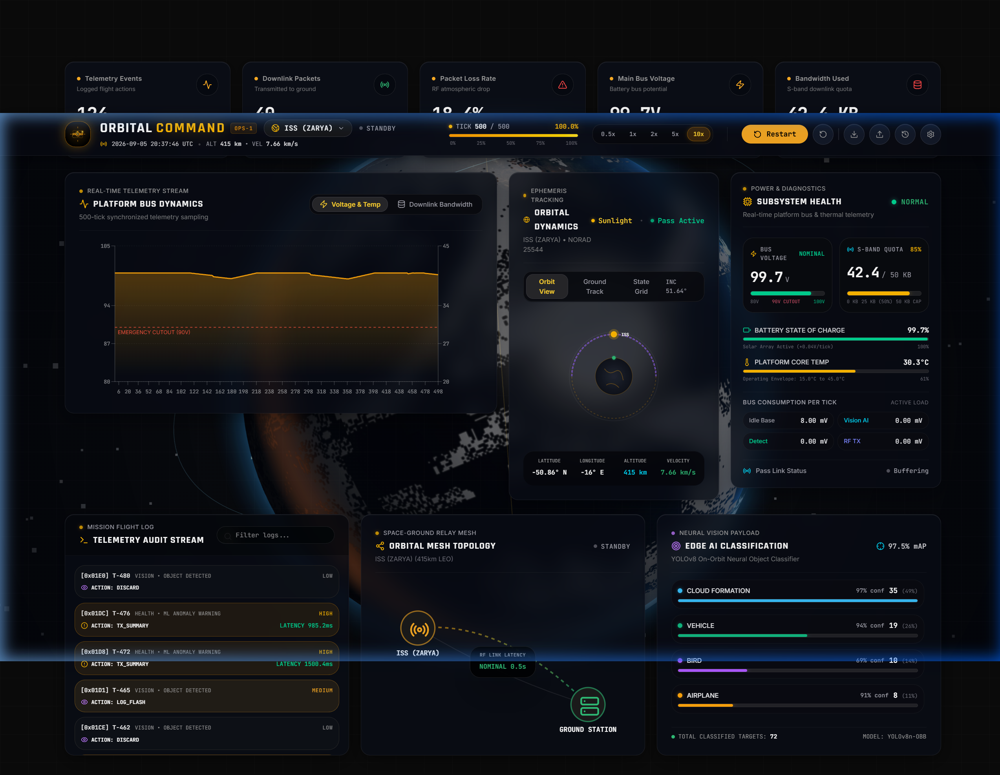
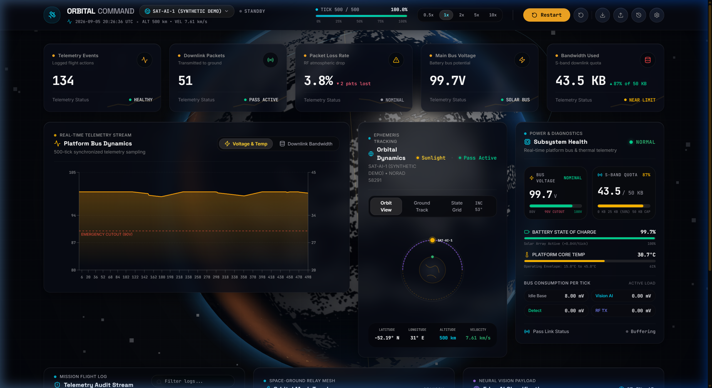
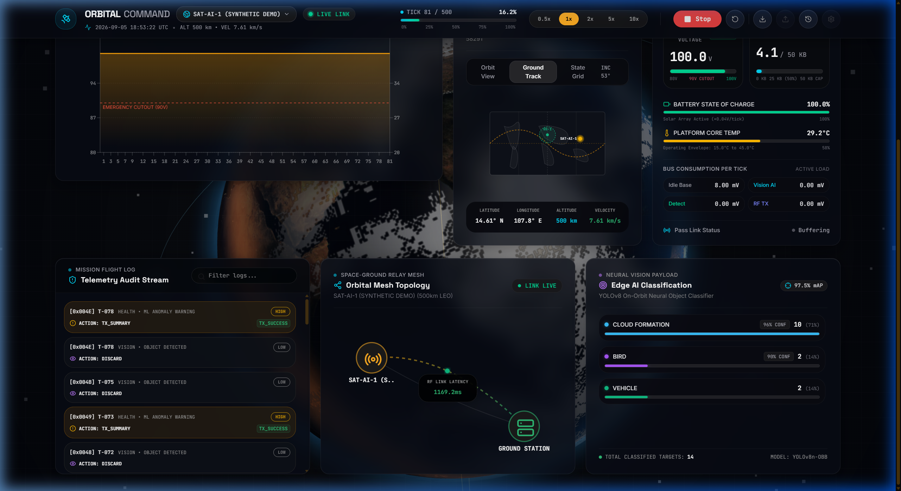
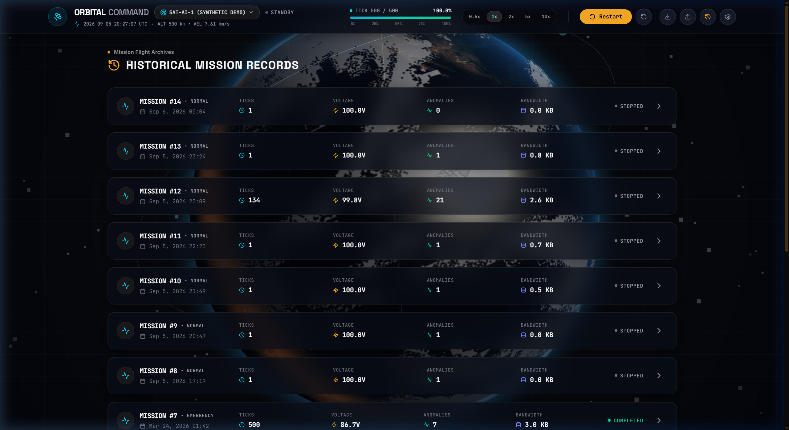
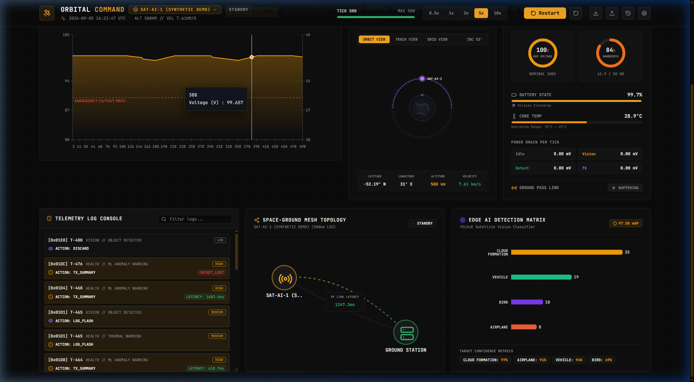

# 🛰️ Satellite AI Simulator | Autonomous Earth Observation & Mission Control Deck

> **Public Architectural Showcase**: This repository presents the architecture, engineering telemetry, and visual mission operations interface for the **Satellite AI Simulator**. The numerical physics kernels and proprietary Edge AI pipelines are maintained under a private repository.

---

## 🌐 Live Mission Operations Demo

Access the interactive mission control operations deck deployed on Render:

🚀 **[Launch Live Mission Control](https://satellite-ai-simulator.onrender.com)**

---

## 📸 Mission Operations Visual Gallery

### 1. Aerospace Mission Control Header & Avionics Telemetry
Featuring custom metallic gold insignia with dual photovoltaic solar array wings, inclined orbital geometry, live beacon pulse, real-time orbit progress track, and millisecond-accurate flight telemetry tickers.

---

### 2. Centered Photorealistic 3D Earth Globe & Orbital Mechanics
High-fidelity WebGL celestial globe rendered with high-resolution landmass texturing, atmospheric Rayleigh scatter glow, active satellite orbital vectors, and dynamic sub-satellite ground tracks.

---

### 3. Edge AI Vision Payload & Avionics Telemetry Deck
Real-time onboard target detection engine (wildfires, maritime vessels, atmospheric storms) operating under strict orbital compute and power constraints. Features live battery depth-of-discharge, radiative thermal balance, and RF downlink bandwidth telemetry.

---

### 4. Mission Archives & Historical Orbital Pass Analytics
Chronological logging and parametric analysis of historical ground station passes, anomaly detections, downlink efficiency, and subsystem health records.

---

### 5. Ground Station Mesh Network & Elevation Tracking
Automated pass prediction, Doppler compensation, and space-to-ground mesh routing across global ground stations (Svalbard, White Sands, Perth, Hartebeesthoek).

---

## ⚡ Key Engineering Highlights

| Subsystem | Architecture & Methods | Performance Target |
| :--- | :--- | :--- |
| **Orbital Mechanics** | SGP4 propagation, J2 zonal gravitational perturbations, WGS-84 coordinate transforms | Sub-meter geodetic positioning accuracy |
| **Edge AI Payload** | Quantized YOLOv8 optical object detection & anomaly classification | <45ms inference latency @ 15W compute |
| **Power Subsystem** | Dynamic solar flux model ($1361 \, \text{W/m}^2$), cylindrical eclipse shadow, LiFePO4 battery DOD | Continuous closed-loop energy balance |
| **Thermal Model** | Radiative equilibrium, solar absorptivity ($\alpha$), IR emissivity ($\epsilon$), space heat sink (3K) | Operational limits: $-20^\circ\text{C}$ to $+65^\circ\text{C}$ |
| **RF Communications** | S-band (2.2 GHz) / X-band (8.4 GHz) Friis transmission, elevation masks, Doppler shift | >99.8% packet reception across contact windows |
| **Telemetry UI** | Three.js WebGL, React 19, Socket.IO streaming, avionics typography (`Rajdhani` / `JetBrains Mono`) | 60 FPS smooth rendering |

---

## 📐 System Architecture

Detailed architectural specifications, mathematical formulations (SGP4 equations, Friis transmission loss, radiative heat balance), and payload pipelines are documented in:

📄 **[System Architecture Documentation](docs/ARCHITECTURE.md)**

---

## 🛰️ Supported Satellite Missions

- **International Space Station (ISS)** — $51.6^\circ$ inclination, $420 \, \text{km}$ LEO altitude.
- **Sentinel-2A** — Sun-synchronous orbit, multispectral Earth observation.
- **Landsat 9** — Repetitive global land surface imaging and environmental monitoring.
- **Starlink Constellation Unit** — High-inclination mega-constellation communications mesh.

---

## 🔒 Proprietary Codebase & Licensing Notice

This repository contains the **design system, system architecture, telemetry visualizations, and interface specifications**.

The proprietary backend, including:
- Numerical orbital integration algorithms
- Hardware-in-the-loop (HIL) telemetry bridge
- Custom YOLOv8 INT8 quantization scripts
- Space-ground protocol buffers

is maintained in the private repository:
🔒 **`geomathewjoseph/satellite-ai-simulator`**

### Project & Connect
- **Geo Mathew Joseph** ([@geomathewjoseph](https://github.com/geomathewjoseph))

---

*Copyright © 2026 Geo Mathew Joseph. All rights reserved.*
